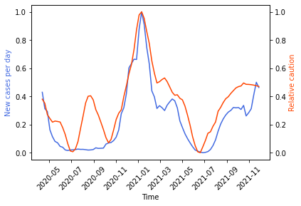
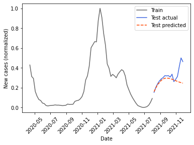
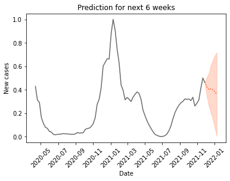
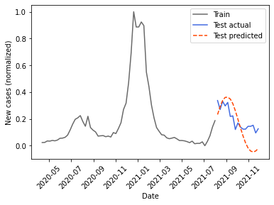
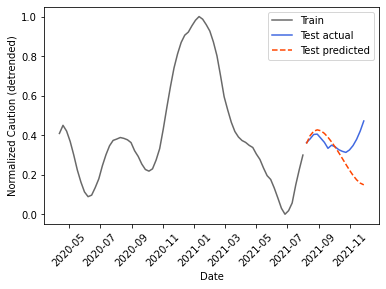
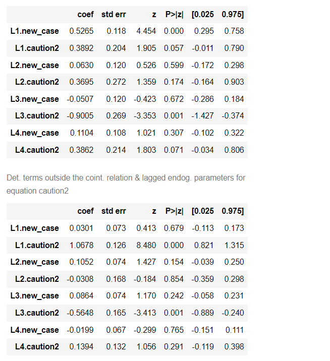

The ability to predict caution levels would aid in economic planning while the ability to predict new cases would help anticipate need for resources and policies as well as improve understanding of factors underlying the pandemic. I attempted to use the caution index in time regression models to forecast caution and new cases.

This portion was completed in Python, although these analyses could have been done in R.

Data on COVID cases were obtained from the [CDC.](https://data.cdc.gov/Case-Surveillance/United-States-COVID-19-Cases-and-Deaths-by-State-o/9mfq-cb36)

The caution index still looked rather noisy, so it was smoothed with a Savitsky-Golay filter. 

The data over the 5-year period is obviously not stationary due to the onset of the pandemic. Upon examining the caution over the period of time since 4/10/2020, an overall declining trend is observed, with fluctuations aligning with each wave of the pandemic. A number of factors may contribute to this decline, such as reduced novelty of COVID-19, increased understanding of how to reopen safely, availability of the vaccine and pill treatments, and lastly pandemic fatigue and desire for a return to normalcy. Conversely, new case numbers are likely underestimated early during the pandemic due to lack of availability of testing. An exponential trend was fit and subtracted from the caution values. 

The resulting detrended caution was highly correlated with new case numbers (e.g., r = 0.80 for NY, r = 0.71 for CA). The lag plot indicated strong autocorrelation and ACF and PACF plots suggests a more AR pattern for new cases and a more mixed pattern for caution. 

An augmented Dickey-Fuller test indicated that these signals were still not stationary after detrending, but log transforming produced signals that were stationary or pretty close. A single round of differencing also worked for creating stationarity, but I was concerned that differencing might disrupt the slower relationship between the variables.
Granger causality was significant for log new cases being predictive of log caution. The reverse causality was also significant for 2 lags. Bidirectional Granger causality was also observed for the once-differenced signals. It is plausible that caution could reduce future cases while high levels of cases would increase caution. While this could reflect some interesting feedback relationship, it could more simply reflect the correlated movement of the two signals. While the original signals were not cointegrated (Engle-Granger test), the detrended caution was cointegrated with cases.

I explored an ARMAX model to try to predict caution, with new cases as an exogenous variable. The log transformed variables were used, so the “I” was not required. ARIMA (2,0,3) was selected by AIC, although (2,0,1) was a close second. This seems reasonable given the ACF and PACF plots. The model performs decently:

However, as mentioned above, new cases may be affected by caution, so, I also experimented with using a VAR(2) model, which again made decent but not amazing predictions. Python’s cointegration test (using Engle-Granger) was significant between detrended caution and new cases, indicating a non-spurious relationship between the two. Therefore, I next tried a Vector Error Correction Model (VECM), which again produced decent but not terrific forecasts.

For NY:

And for CA:

The model fit for NY has interesting potential interpretations. Aside from the variables having positive coefficients with themselves at a lag of 1, new cases were related with a significant negative coefficient to caution at a lag of 3 weeks, possibly reflecting a protective effect of caution on new cases. Caution was also negatively related to itself at lag 3, which may reflect a caution fatigue phenomenon.

However, we should take these interpretations with a grain of salt. This pattern was also seen in the fit for NY over the entire data period, but the negative lag 3 coefficient of caution in predicting new case was not present when fitting the data for CA, but was possibly compensated for by the larger positive lag 1 coefficient of caution since the lag 3 coefficient of caution on itself was still negative. In general, these fits were not robust and depended on the state, time range, segment being predicted, etc. Some possible reasons would be:

1)	Everything moving together with superimposed noise - likely high collinearity between lagged terms and the exogenous variable in the ARIMAX. It may be hard to get a unique solution and consistent coefficients in this case, even if predictions are decent. It may be hard to say what is causing what. 

2)	Insufficient cycles of meaningful fluctuation – even though the pandemic feels like it has been going on forever, only a few COVID-19 waves and seasonal cycles of data are available. For instance, when I tried integrating average temperature data and fitting the first 80% of the data, it appeared to be dominated by the winter surge of 2020, disrupting predictions for 2021. Also, the number of data points is not many times greater than the number of fit parameters.

For the VECM, six week forecasts on new cases with training sets of 80%, 85%, and 90%, had an average MAPE of 10.4%, as compared with 16.0% for naïve method. For forecasting caution, the VECM had an average MAPE of 10.0%, the ARMAX model 7.6%, and the naïve 10.1%. Apparently, it is pretty common for complex methods to perform similarly to simple methods, particularly with limited data and on out-of-sample prediction, e.g., [this discussion](https://stats.stackexchange.com/questions/124955/is-it-unusual-for-the-mean-to-outperform-arima).

Generally, reasons for errors in forecasting include:

1)	Trying to forecast too many periods into future – the 20% testing set is 17 steps (weeks), which would move away from the actual values.

2)	Seasonality already taken out of caution index and COVID-19 seasonality unclear - I suspect fits generally look better with obvious seasonality since those are large fluctuations that are relatively easy to account for. 

3)	Missing exogenous variables – only two variables are considered (plus temperature), so we are likely missing a lot of other information. For instance, gatherings over holidays may not be reflected in restaurant-related behavior and the arrival or new variants and their coverage in the media may impact caution and new cases. 

