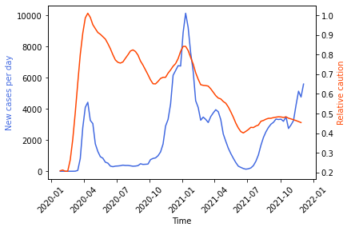

The ability to predict caution levels would aid in economic planning while the ability to predict new cases would help anticipate need for resources as well as improve understanding of factors underlying the pandemic. Using the caution index constructed in part I, several time regression models are tested for forecasting caution and new cases.

Data on COVID cases were obtained from the [CDC.](https://data.cdc.gov/Case-Surveillance/United-States-COVID-19-Cases-and-Deaths-by-State-o/9mfq-cb36)

The caution index still looked rather noisy, so it was smoothed with a Savitsky-Golay filter. 

The data over the 5-year period is obviously not stationary due to the onset of the pandemic. Upon examining the caution over the period of time since 4/10/2020, an overall declining trend is observed, with fluctuations aligning with each wave of the pandemic. A number of factors may contribute to this decline, such as reduced novelty of COVID-19, increased understanding of how to reopen safely, availability of the vaccine and pill treatments, and lastly pandemic fatigue and desire for a return to normalcy. An exponential trend was fit and subtracted from the caution values. 

The resulting detrended caution was highly correlated with new case numbers (e.g., r = 0.79 for NY, r = 0.69 for CA). The lag plot indicated strong autocorrelation and autocorrelation plots showed positive short-term correlation and negative correlations at longer lags, likely related to the oscillating COVID-19 wave structure.

