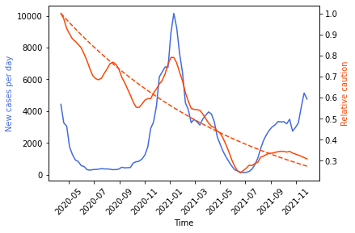

The ability to predict caution levels would aid in economic planning while the ability to predict new cases would help anticipate need for resources as well as improve understanding of factors underlying the pandemic. Using the caution index constructed in part I, several time regression models are tested for forecasting caution and new cases.

Data on COVID cases were obtained from the [CDC.](https://data.cdc.gov/Case-Surveillance/United-States-COVID-19-Cases-and-Deaths-by-State-o/9mfq-cb36)

The caution index still looked rather noisy, so it was smoothed with a Savitsky-Golay filter. 

The data over the 5-year period is obviously not stationary due to the onset of the pandemic. Upon examining the caution over the period of time since 4/10/2020, an overall declining trend is observed, with fluctuations aligning with each wave of the pandemic. A number of factors may contribute to this decline, such as reduced novelty of COVID-19, increased understanding of how to reopen safely, availability of the vaccine and pill treatments, and lastly pandemic fatigue and desire for a return to normalcy. An exponential trend was fit and subtracted from the caution values. 

The resulting detrended caution was highly correlated with new case numbers (e.g., r = 0.79 for NY, r = 0.69 for CA). The lag plot indicated strong autocorrelation and autocorrelation plots showed positive short-term correlation and negative correlations at longer lags, likely related to the oscillating COVID-19 wave structure.

An augmented Dickey-Fuller test indicated that these signals were still not stationary after detrending, but log transforming produced signals that were sufficiently stationary (p-values of 0.047 and 0.028). A single round of differencing also worked for creating stationarity, but I was concerned that differencing might disrupt the slower relationship between the variables.

Granger causality was significant for log new cases being predictive of log caution. The reverse causality was also significant for 2 lags. Bidirectional Granger causality was also observed for the once-differenced signals. It is plausible that caution could reduce future cases while high levels of cases would increase caution. While this could reflect some interesting feedback relationship, it could more simply reflect the correlated movement of the two signals. While the original signals were not cointegrated (Engle-Granger test), the detrended caution was cointegrated with cases.

I explored ARIMAX modeling to try to predict caution, including new cases as an exogenous variable without lag. However, as mentioned above, new cases may be affected by caution). Therefore, I also investigated using a VAR(2) model. Although both of these were able to make reasonable predictions for NY, they were not robust. For instance, the coefficients on the exogenous variable were sometimes positive, sometimes negative, sometimes highly significant, sometimes not significant, depending on the state, time range, segment being predicted, etc. Perhaps the high redundancy of the data and likely collinearity between lagged terms and the exogenous variable are causing issues. 

So next I tried a Vector Error Correction Model (VECM) using the detrended but not log transformed signals, which also produced reasonable estimates.

