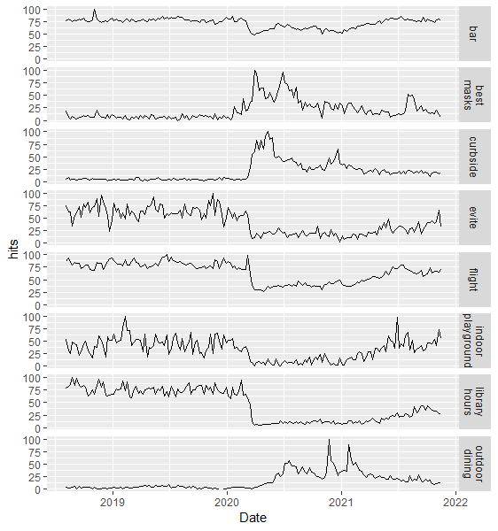
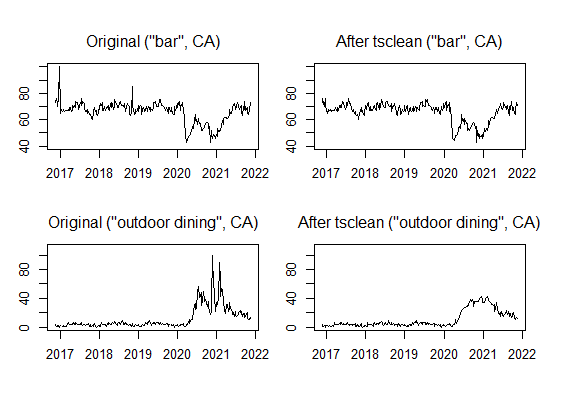
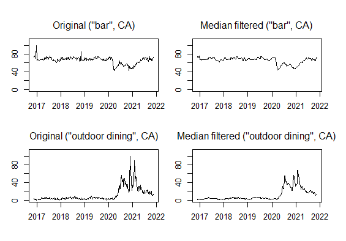
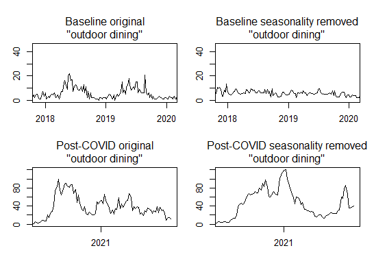
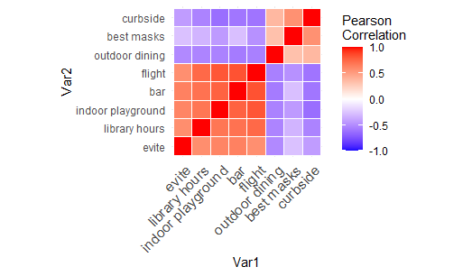
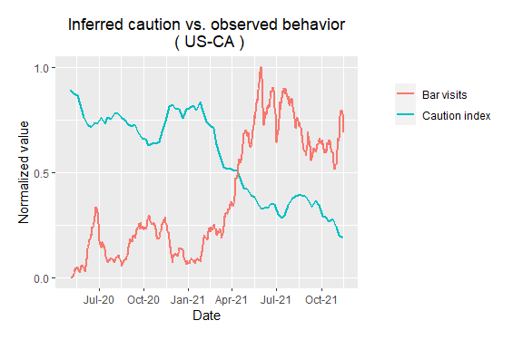
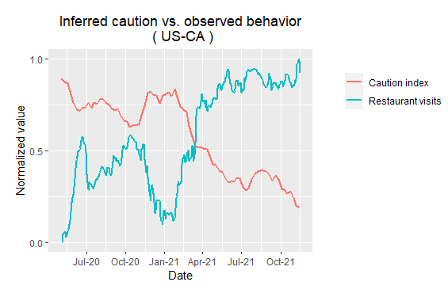
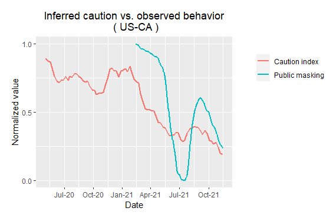

## Creating a COVID Caution Index from Google Trends Data

Google Trends provides easily accessible data on the relative changes in the popularity of various search terms. I tried to construct an index of inferred behavioral caution related to COVID-19 from this data.

### Search Terms

I tested search terms that might be related or inversely related such as “outdoor dining”, “best masks”, and “flight”. Ideal search terms would have sufficient overall search volume, show high levels of modulation to COVID, be rapidly responsive to changing conditions, and be available for as many states as possible. All these search terms were strongly affected by the COVID crisis, reflecting a massive disruption to society (data for California shown):   

“Library hours” seemed to respond sluggishly during the pandemic, perhaps because people were less keen to resume library use than, say, restaurant dining. Sometimes paradoxical effects are also seen. For instance, interest in “Indoor dining” (not shown) peaked in the middle of the pandemic, presumably because of the difficulty of finding indoor dining. “Outdoor dining” seemed a better measure of caution but was sensitive to climate – it was not available for Alaska, and showed milder seasonality for California. Some states had overall low search volume, e.g., Wyoming. I decided to first try working with data from the 5 most populous states. 

### Data Pre-processing

NaN values were imputed with a simple moving average.

The function tsclean() did a good job of removing impulse noise (e.g., a sharp peak in “bar” on New Years Eve 2017), but seemed too aggressive on the peaks that occurred during the pandemic. 

Instead, I chose to use a median filter with window size 3, which smoothed out impulse outliers while leaving more structure during the pandemic period. 

### Seasonality

Many of these search terms exhibited clear seasonality, which was taken into account via multiplicative seasonality decomposition. Without sufficient cycles, the seasonal average can be noisy, and dividing by it can introduce noise. However, querying for more than 5 years returned resulted in monthly rather than weekly time resolution. As Google Trends results are normalized within the returned data rather than showing absolute scale, stitching together multiple periods is non-trivial. It could be done by querying the longer time period, aggregating to the annual level, then determining the scale factor for queries of shorter time periods. For now, I will rely on data from the past 5 years.

Seasonality seemed to be removed well from the baseline period, and substantially impacted the shape of the post-COVID curve.

### Validity and Index Construction

Next, we checked whether these indices seemed to reflect some common underlying variable. As people’s understanding of caution (such as mask wearing, social distancing, and outdoor activities) changed rapidly during the first months of the pandemic, data was considered from 2020-05-20 onward. The clustered correlation matrix shows that the terms are strongly correlated or anticorrelated with each other.  

(Reordered correlation matrix heatmap code excerpted from [STHDA](http://www.sthda.com/english/wiki/ggplot2-quick-correlation-matrix-heatmap-r-software-and-data-visualization).)

A principle component analysis was performed with the search terms as column. PC1 was selected as the caution index and accounted for 78% of variance. The loadings on each search term were similar in magnitude, but terms that reflected caution (“curbside”, “outdoor dining”, “best masks”) had positive signs and terms that were inversely related to caution (“library hours”, “bar”, “indoor playground”, “evite”, “flight”) had negative signs. 

To compare the movements of the caution index to external measures of behavioral caution, I used data from [COVIDcast hosted by the Delphi Group at Carnegie Mellon University](https://delphi.cmu.edu/covidcast/).

Restaurant and bar data is based on SafeGraph tracking of visits made by those with SafeGraph’s apps to bar-related or restaurant-related points of interest. Masking data is based on Facebook surveys and shows the estimated percentage of people who reported wearing masks for most or all of the time while in public in the past 7 days. 
Restaurant and bar visits moved remarkably in antiphase with caution, while mask use moved in phase. However, mask use as measured by the survey appeared time-lagged and had larger fluctuations than the caution index.  

The meaning of caution may have evolved during the pandemic. For instance, many people may have dispensed with outdoor masking but returned to indoor masking following the nadir of caution in July 2021. They may consider visiting a library with masks on or indoor dining with proper ventilation and distance between tables to be low risk.
Also, as we get the hang of post-COVID living, the application of caution may require less information seeking. Perhaps people already have their favorite masks and locations for safe dining and search volumes may decline due to the reduced need for information.

